# Sketch 101 Cambridge Class

## *Lovingly taught by one Nicholas W. Inzucchi*

### Prerequisite software installs:

[**Sketch 3.2.2 Demo**](http://bohemiancoding.com/sketch/) 
[**Sketch Mirror** (Optional)](https://itunes.apple.com/us/app/sketch-mirror/id677296955?mt=8) 

In retrospect Sketch is a tremendously obvious product. Digital designers had no tool for designing digital products. Before Sketch, our best tools were Photoshop and Illustrator. Both are burdened by years of cruft; hundreds of distracting features useful only for photos and print. Sketch distinguished itself by being entirely focused on UI.

Because if this tremendous focus, Sketch is easy to learn and has sparked a revolution in digital design. Some shining features: 

- **Vector-Based** : Vector assets make exporting to multiple devices is a breeze. 
- **Pixel Snap/Zoom** : Be confident designs on desktop will look exactly the same on a device. 
- **Mirror** : A built-in iPhone previewing makes for a hyper-efficient tweaking. 
- **Text Rendering** : 100% accurate rendering across retina screens and sub-pixel aliased devices. 
- **Rapid Exports** : No more bullshit file renaming. Set names once and use a single shortcut to render out. 

In this tutorial we’ll learn Sketch by crafting a slightly twisted Mobile dating app: Chase. Ready? Let’s begin.

# Basic Interface

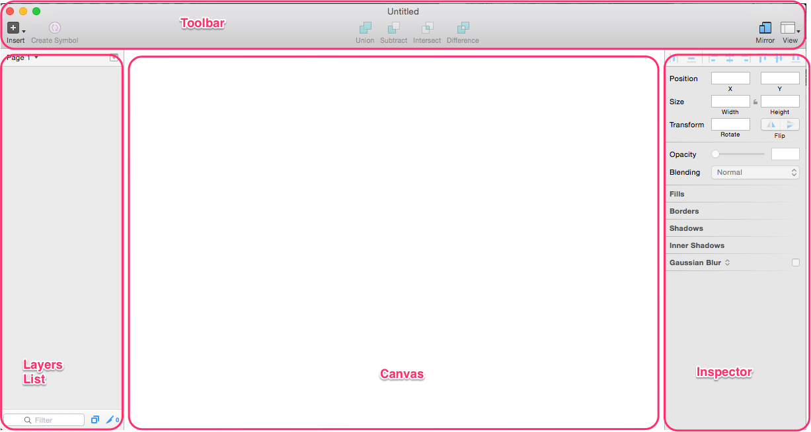

Before diving into our app, let’s take a 50,000 foot view of the Sketch work environment.

## Toolbar
The toolbar contains icons that represent basic operations. This area is mostly a crutch for beginners. As you master keyboard shortcuts, its utility will steadily decrease. I now use mine only for boolean operations and mirroring.

Speaking of keyboard shortcuts, here’s a [stellar reference](http://sketchshortcuts.com/). I’ll try to enclose shortcuts in brackets [Like Such] throughout the text below.

## Layers List
In Sketch, everything is a **Layer**. Unlike Photoshop, every Shape, Image, Group and Text Block acquires the same uniform status. Layers are therefore our basic building blocks. The Layers List shows all Layers contained within the current page.

There’s a level of hierarchy above what’s seen in the Layers List, and that level consists of Pages. Pages are like separate Sketch files, but within the same Sketch file. Why would you want that? Well, graphics problems hog a TON of memory. Memory helps them resolve overlaps, calculate blends, combine transparent effects, and still redraw quickly. Sketch uses Pages to speed things up with massive files in play. Use them to split huge documents into logical parts. Not only will performance remain high, but your sanity will benefit as well.

## Inspector
If you’ve ever use iWork (e.g. Keynote, Pages, Numbers), you’re already familiar with inspectors. The Inspector shows all properties of the currently selected object.

## Converting from Adobe
Welcome! In time, I’m sure you’ll love Sketch. Here are some common hang-ups to help ease your transition:

- **No Select Tool** : Sketch has no concept of a Selection Tool, per se. That means you can stop pressing [v] all the time! By default, your cursor is a selector. Every other draw operation is a temporary state that resets when the operation completes. Use [esc] instead of [v] to return to this smart default.
- **No Point Select Tool** : Sketch has no concept of a Direct Selection Tool. That means you can stop pressing [a] all the time! To edit curve points, just double click on the shape. This enters edit mode. To return press [esc]
- **Deep Select** : By default clicking on a shape selects the top-most folder. Cut through the hierarchy by holding ‘cmd’ as you click. This will select the bottom-most object.

# Artboards

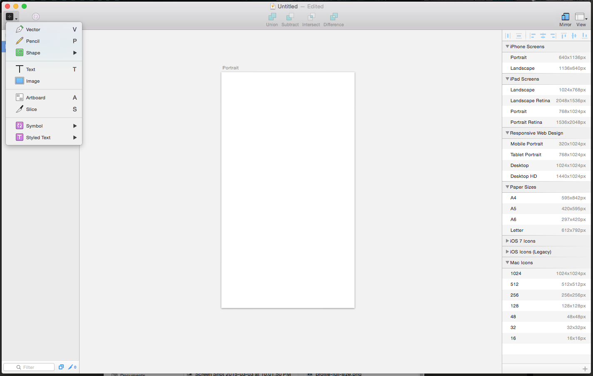

Sketch greets you with a blank, infinite canvas. You can work here just fine, but pretty soon you’ll see some structure. Art boards form the basic structure of your app. They provide a top level of hierarchy and make exporting simple. Use one per screen.

Let’s create an art board for our splash screen by with **Insert > Artboard** [a]. The inspector updates to show several common sizes *(No more Googling screen resolutions!),* Go ahead and select **iPhone Portrait**.

An artboard can be selected in the Layers List, or by clicking its name on the canvas. Feel free to select the current artboard and check out its properties in the Inspector. 

While we’re poking around, try double clicking on the artboard’s name in the Layers List. Rename it to ‘Splash’ like a |30$$.

# Shapes

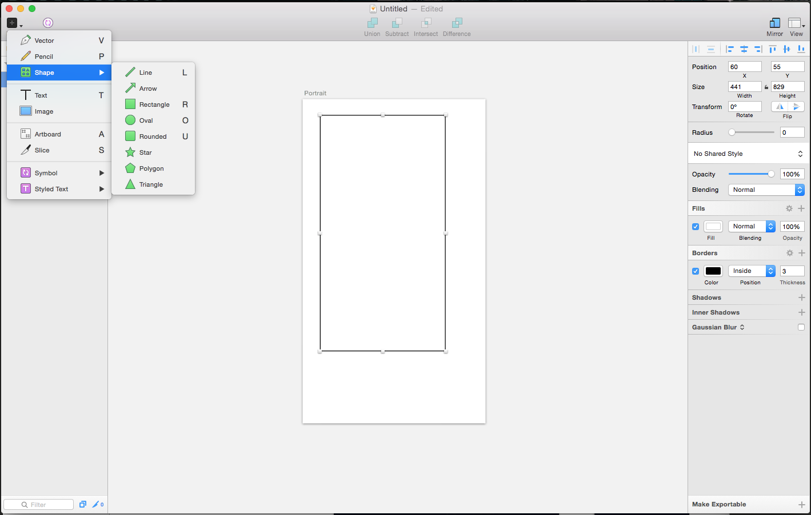

Our splash screen needs a background, so a **Rectangle** is in order. Add a rectangle with **Insert > Shape > Rectangle** [R]. Drag anywhere on the art board to create your Rectangle, then check out the inspector.

## Transforming

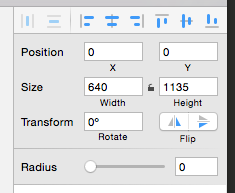

All Layers have a set of common transformation properties: Position, Size and Rotation. Type directly in these boxes to set your rectangle’s position to [0,0] and its size to that of our artboard (640,1135).

**Pro-Tip**: *Adjust any value by clicking once within it, then hitting [**up / down**]. **[Shift + up / Shift + down]** adjusts in increments of 10. You can also use algebra in these fields (e.g. 1024/8). The next version of Sketch will also add support for percentages.*

## Styling

All Layers also have common appearance properties: Opacity, Blending, Fills, Borders, Shadows, and Blur. Our app demands a dark background to fit its mysterious mood. Click the **color swatch** in your rectangle’s ‘Fills’ field. 

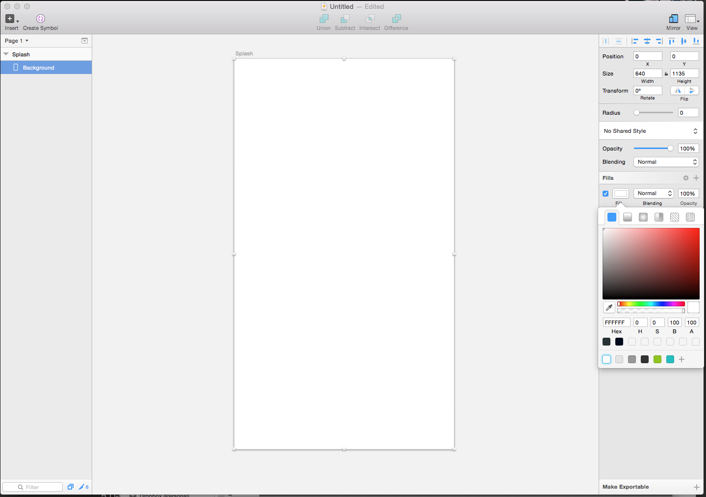

This color selector is pretty great. Digital first, it accepts Hex codes and uses HSLA by default. 

Below the selector are two rows of swatches. The first row is for colors Sketch automatically detects as present in your design. The second row is for custom swatches; add a new one by pressing the [+] button. Go ahead and select a dark, moody color.

Gradients are also available for advanced students to tinker with. They come in Linear, Radial and Angular flavors. Patterns and Noise fills are really just for showing off.

## Advanced Transforming

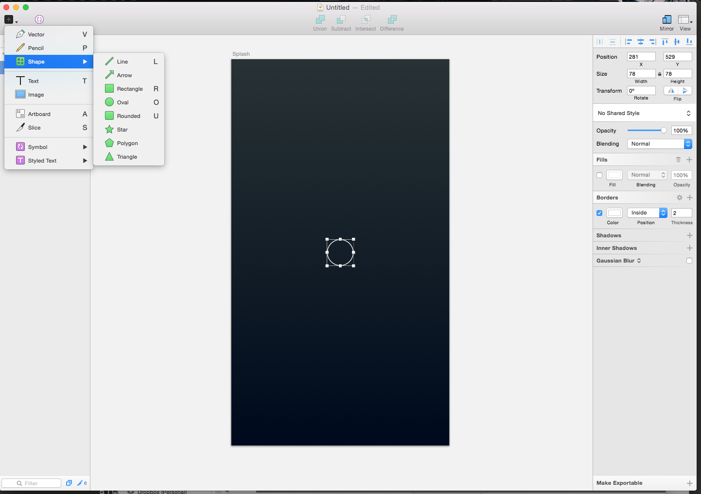

Dating is about finding that special someone, so naturally a reticle shall be our logo. Let’s start with a circle. Create one using **Insert > Shape > Oval** [O] and set its dimensions to (78x78). Give it a simple white border and remove its fill by unchecking the box next to its default swatch.

**Pro-Tip**: *Delete unused style attributes by clicking the trash icon in the header. This helps keep files nice and clean.*

### Smart Guides

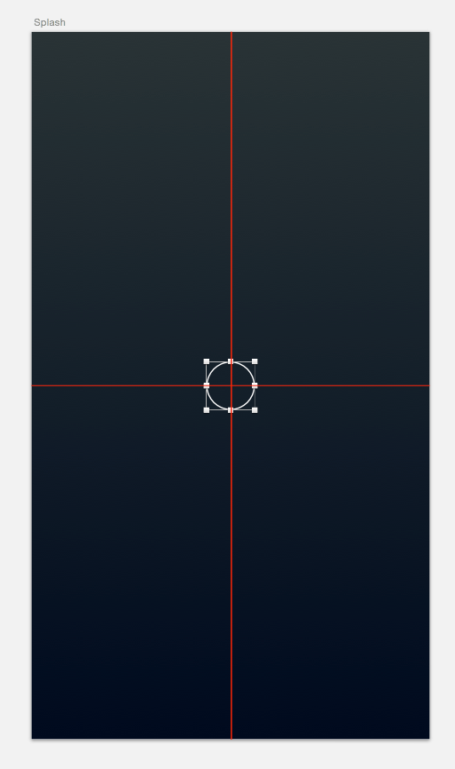

We’ll use **Smart Guides** to position our circle in the exact center of our artboard. Click and drag the circle toward the center of the artboard. Red guides will help lead you to the center. By default Sketch also snaps to points, edges, and alignment points (e.g. top, center, bottom) of nearby objects.

### Measuring

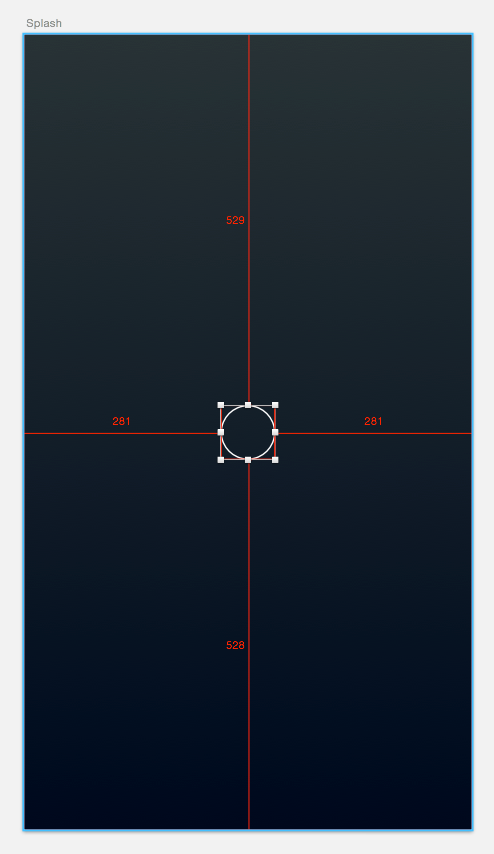

Just to be sure we got it perfect, select the circle and hold down [Alt]. Sketch will show you the distance to surrounding artboard edges. 

All good? Total perfectionists should feel free to employ **View > Show Rulers** [Ctrl + R]

### Aligning

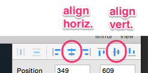

Create one more rectangle anywhere on screen, and make it (2x78). This will be one crosshair on our reticle. This time we’ll use Sketch’s **Alignment** tools to position things correctly. Select the rectangle and **Arrange > Align Objects > Horizontally** then **Arrange > Align Objects > Vertically** (You can also complete both operations in the Inspector).

### Rotating

A reticle needs two crosshairs, though. Duplicate our first rectangle using **Edit > Duplicate** [Cmd + D], then rotate it 90° using the inspector. Boom, trus me daddy.

## Advanced Drawing

### Boolean Operations

Unless you can see your target, a reticle just gets in the way. We’ll need to cut out a square area between those two lines, but how? The answer is Boolean.

First let’s join both rectangles into a single shape. Select both by holding [Shift] or [Cmd] as you click them in sequence. Now use **Layer > Combine > Union** to fold them into a single shape. In the Layer List, both rectangles appear nested as if in a folder. This presentation allows us to easily edit source components if necessary.

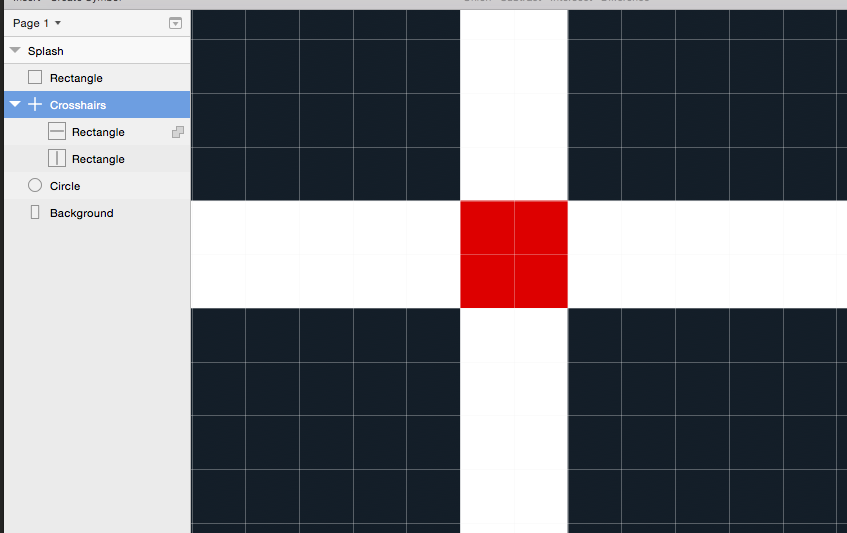

Second, let’s draw a square to mark the area we want removed. Pixel Zoom is the secret sauce here. Pinch to zoom way in until each pixel is outlined. Draw a (2x2) Rectangle right there in the center.

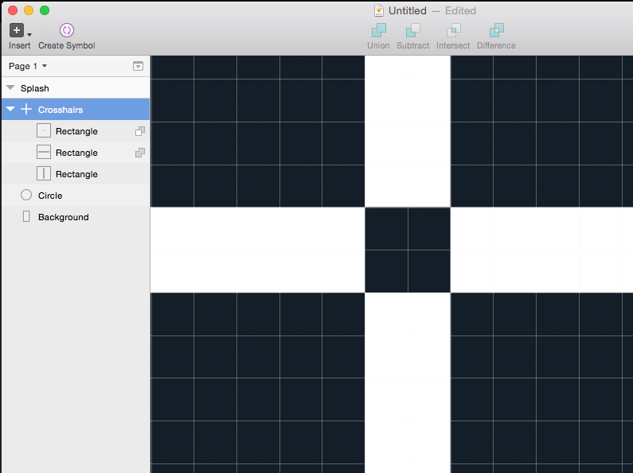

So far so good. We’ll now use a **Subtract** operation to remove that square region from our crosshairs. In the layer list, select both the square and crosshairs. Now use **Layer > Combine > Subtract** to perform the subtraction. Shab-Shab-Shabba Ranks.

# Images

At this point we’ve got a nice, simple foundation on which to build. If this app is to succeed, we need bold imagery. Let’s liven up our background with a hot cityscape.

Check out your assets folder, and drag **city.jpg** onto the canvas.

## Basics
Images function just like Rectangles. They even have all the same properties, including Fill. Sketch embeds images into the file; there is no way to link externally. To update images after importing, **Layer > Image > Replace…** is your best option.

## Masks
Position your image within your artboard. We’ll now use a mask for extra style. Create a rectangle and size it to fill the whole Artboard, minus about 10 pixels from each edge.

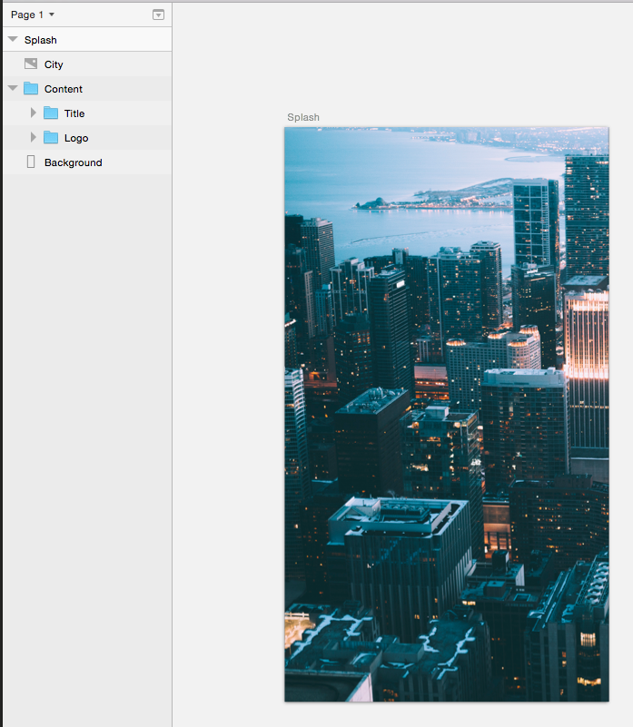

In Sketch, any layer can serve as a mask for any number of other layers. Masks always go below the content they clip, so drag your Rectangle just below your Image in the Layers List. Now turn the Rectangle into a mask by **[Cmd + Clicking]** its name in the Layers List and choosing **Use as Mask**. 

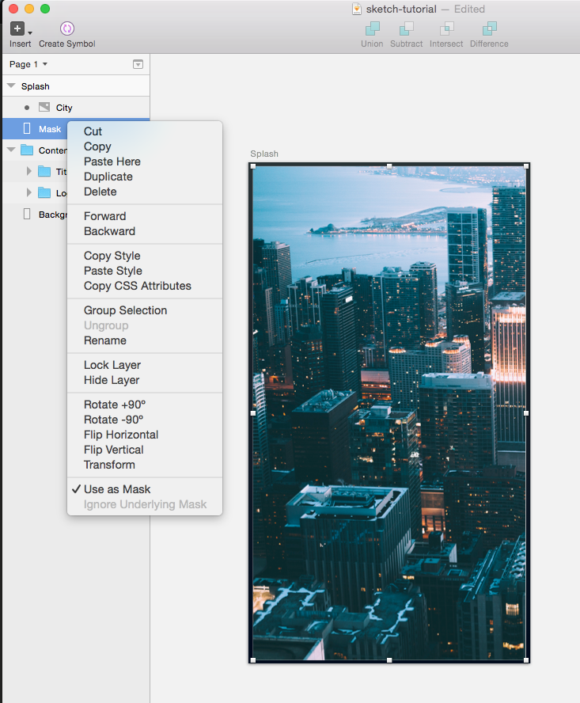

All layers that are *both* above the mask *and* within its container will be clipped. Use folders to isolate masks and control their effects. Group our Mask and Image together by selecting both in the Layers List and choosing **Arrange > Group Layers** [Cmd + G]. Also drag it down to just above our Background Rectangle.

## Advanced Masking

Sketch is adept at both Shape and Alpha Masks. A subtle fade will help create just the right mood. To change or mask mode, select the Mask and choose **Layer > Mask Mode > Alpha Mask**.

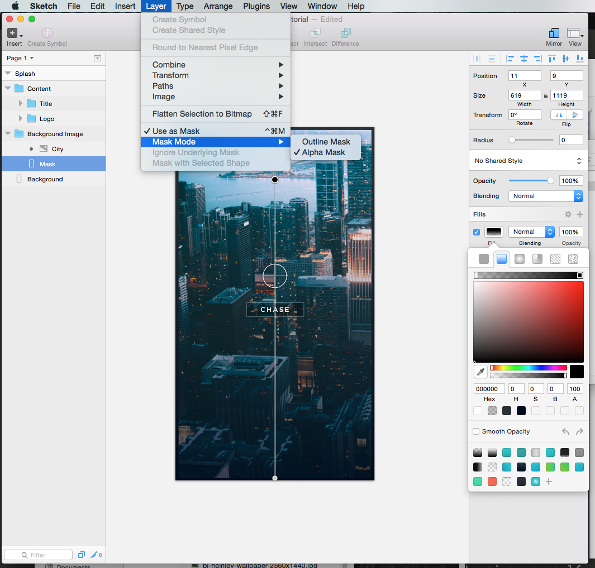

Alpha masks reveal clipped content based upon the Alpha of their fill. Make sure your mask has gradient fill, and that one of the gradient control points has an alpha < 0. Swizzeet.

# Reusability

Sketch has several BADASS features to eliminate tedium from the day-to-day of UI design. Many of these revolve around reusability. Let’s play with a few as we make our way deeper into dating.

## Shared Styles

Shared styles allow many Layers to share a single set of physical attributes. Shared Styles collect Fill, Border, Shadow, Inner Shadow, Blur, and Color Adjust.

Our app needs a Log In feature. Let’s use Shared Styles to make sure we maintain a unified visual language. First, select the Rectangle behind our app title. Click on the words ‘No Shared Style’ within the Inspector, then select ‘Create New Shared Style.’ Give it a name and press return. 

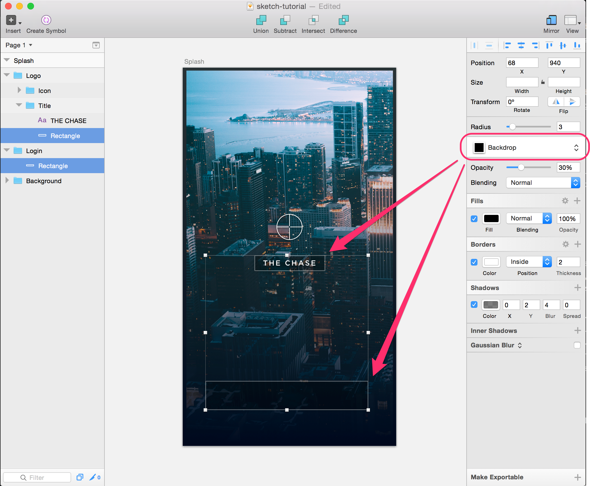

We can now apply that style to any shape. Make a new rectangle near the bottom of the screen; this will be our Login path. Select it, and choose your Style from the dropdown. Donezo — The styles are now linked.

## Text Styles

Text Styles work just like Shared Styles. In addition to the physical attributes of Shared Styles, Text styles also store typographic information like Font and Paragraph settings.

Let’s use text styles to finish our new Login button, ensuring we keep a clean typographic slate. First, select the title of our app. Click on the words ‘No Text Style’ within the Inspector, then select ‘Create New Text Style.’ Give it a name and press return.

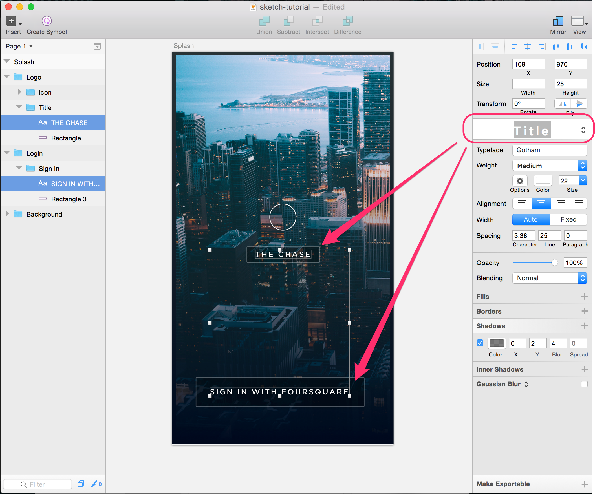

Now add a new text block with **Insert > Text** [t]. This microcopy should invite users to get started. Once done writing, hit [esc]. The text box should remain selected. Now select your new Text Style from the dropdown. Shazam — The styles are now linked.

## Symbols

Symbols let you reuse groups of content easily across pages and artboards. In reality, a Symbol is nothing than a special kind of group. It even looks like group the Layer List, but is purple instead of blue.

It would be great if our splash screen was interactive. That way, users could learn about the app even if they’re hesitant to log in or sign up. A carousel seems natural, meaning we’ll need some dots to indicate position. All dots will be identical, so this is an ideal time to use a Symbol. 

### Creating Symbols

Create an (18x18) circle. Select it and choose **Layer > Create  Symbol**. The shape layer will be grouped within a purple Symbol folder. Duplicate [Cmd + D] the Symbol 3 times to create more dots. Align them vertically, distribute horizontally, and center the group within the Artboard.

### Editing Symbols

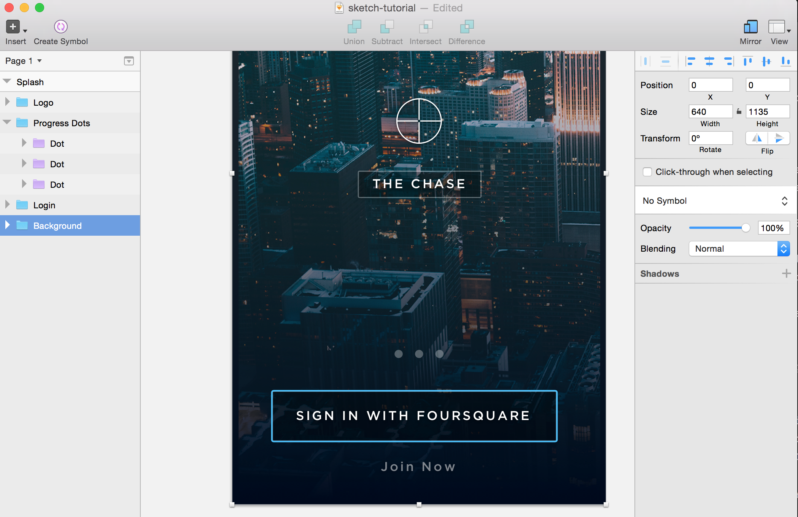

That’s a decent start, but they look a little big. We wouldn’t want to detract too much attention from the call to action. Deep-select one of the circles by holding [Cmd] and clicking right on it. Scale it down to (14x14), then press [3] to drop its opacity to 30%. See how all the other circles changed as well? Now you’re rocking with symbols.

### Detaching Symbols

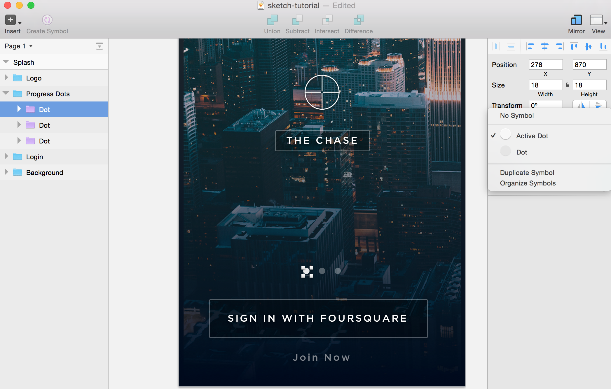

If we’re on the first page of our walkthrough, the first progress dot should illuminate. However because this dot is attached to a symbol, any changes will be reflected in all others. We’ll need to detach it from the Symbol. 

Select the first dot on the Canvas or Layer List. Be sure to select the Symbol and not just the Shape within it. In the inspector, click the Symbol’s current name and select **Duplicate Symbol**. Let’s call this new symbol ‘Active Dot’; we’ll likely want to reuse it on subsequent screens. Now you can bump the dot’s opacity up to 100% without fear of affecting anything else.

# Exporting

Because it’s designed for digital, Sketch assumes you’ll want to export assets separately and frequently. This can be accomplished in two main ways: Direct Export & Batch Export. 

## Direct Exporting
To get our Artboard out of Sketch, we first need to make it Exportable. Select it, then click **Make Exportable** at the very bottom the inspector. 

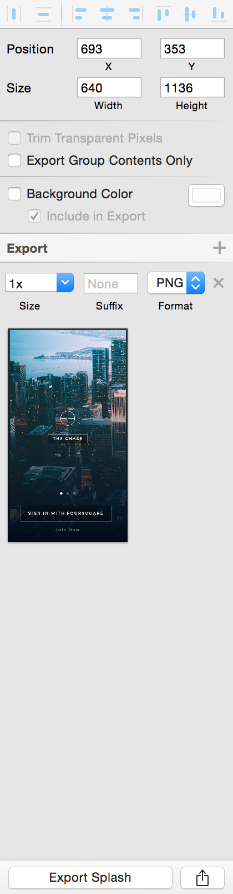

This reveals a set of export options to the inspector. The ‘Size’ field is especially notable. It accepts multipliers (e.g. 1x, 2x, 3x) pixel sizes (e.g. 700h, 300w) and even pixel densities (e.g. 150dpi, 300dpi).

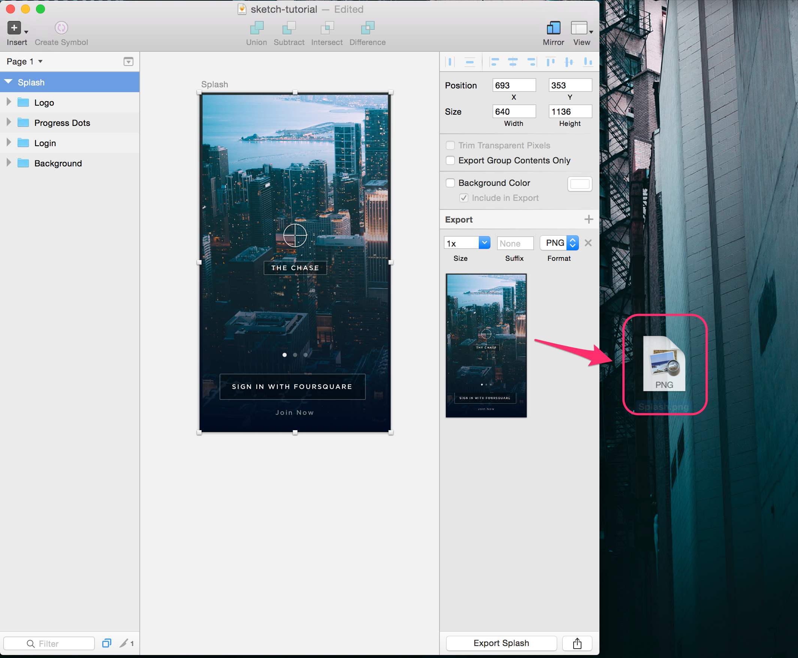

From here, there are two ways to directly export the selected artboard. The first is to drag the small preview anywhere outside the Sketch app. The second is to click **Export [Layer Name]** at the bottom of the inspector.

## Batching
Exporting artboards is great for quick communication, but our developer needs separate layers to begin prototyping. To satisfy her, we’ll use batch exporting.

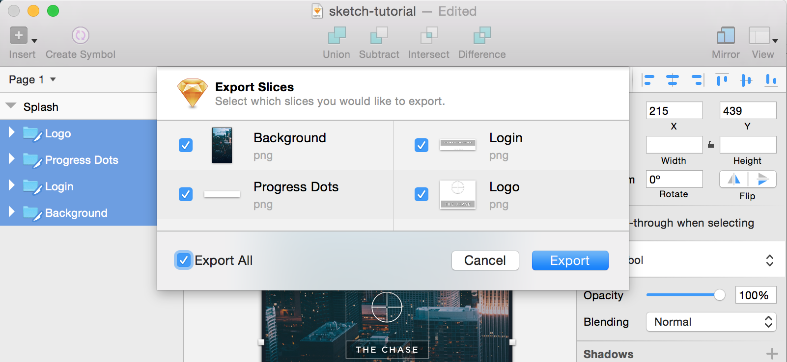

Go through the Layer List and tag the Background, Logo, Progress Dots, and Login Button as exportable. Now select **File > Export…** [Cmd + Shift + E]. The resulting popup shows line items for each exportable layer. Simply hit **Export** and choose a location. Since exported layers automatically overwrite older versions, this feature makes asset updating incredibly painless. 

## CSS Styles

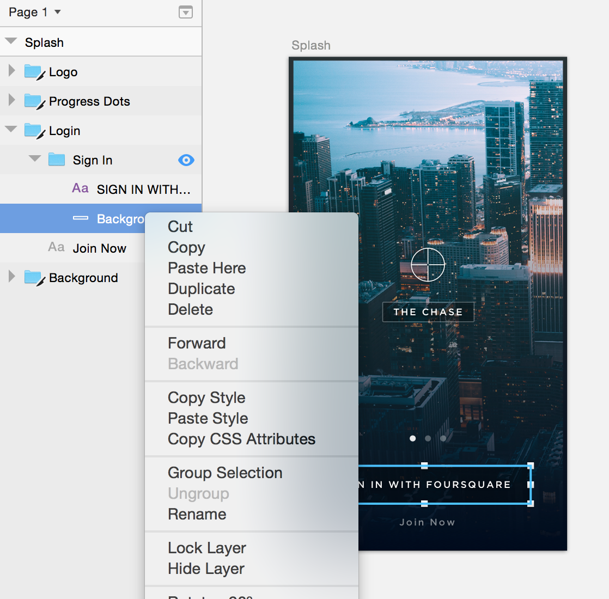

After seeing our design, our developer would rather code the login button in straight HTML. Luckily, Sketch supports one-click exporting of CSS styles. Right click on your button’s background rectangle and select **Copy CSS Attributes**. Your clipboard should now contain the following:  

``/* Background: */
opacity: 0.3;
background: #000000;
border: 2px solid #FFFFFF;
box-shadow: 0px 2px 4px 0px rgba(0,0,0,0.50);
border-radius: 3px;``

# Other Dope Features

## Opacity Keys

When you select a Layer or a Group and press the 1 key, it’ll set it to 10% opacity.

## Presentation Mode

A fantastic way to present your UI to your co-workers without the noises. Just press Command + .

## Mirroring

Sketch can mirror natively to any iOS device, it’s dope! 

## iCloud Versioning

Sketch has Autosave enabled. It keeps the versioning of your files, so you no longer run into the problem of having to save files manually or risk losing edits. To restore an old version, go to File / Revert To / Browse All Versions.

## Layout Grids

If you love layout grids such as the 960grid, then you’re in luck. Sketch has a fantastic Grid feature. You can create virtually any grid you’d like. This is particularly helpful for the Web.

## Plugins

Some favorites include Sketch Mate, Renameit, and Swap Fill Border.
